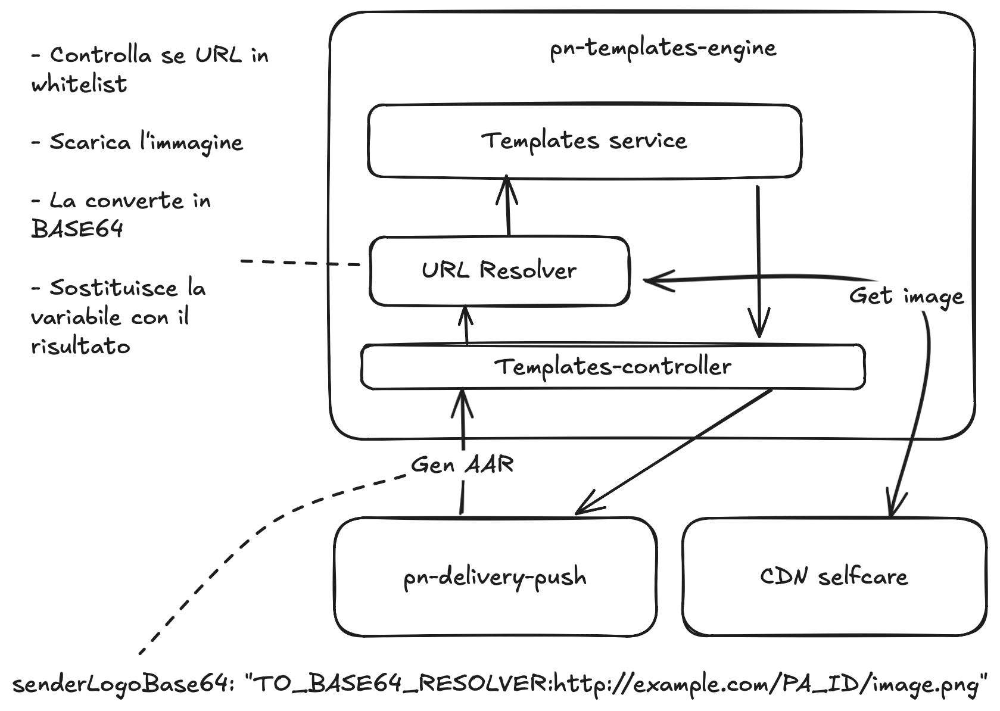
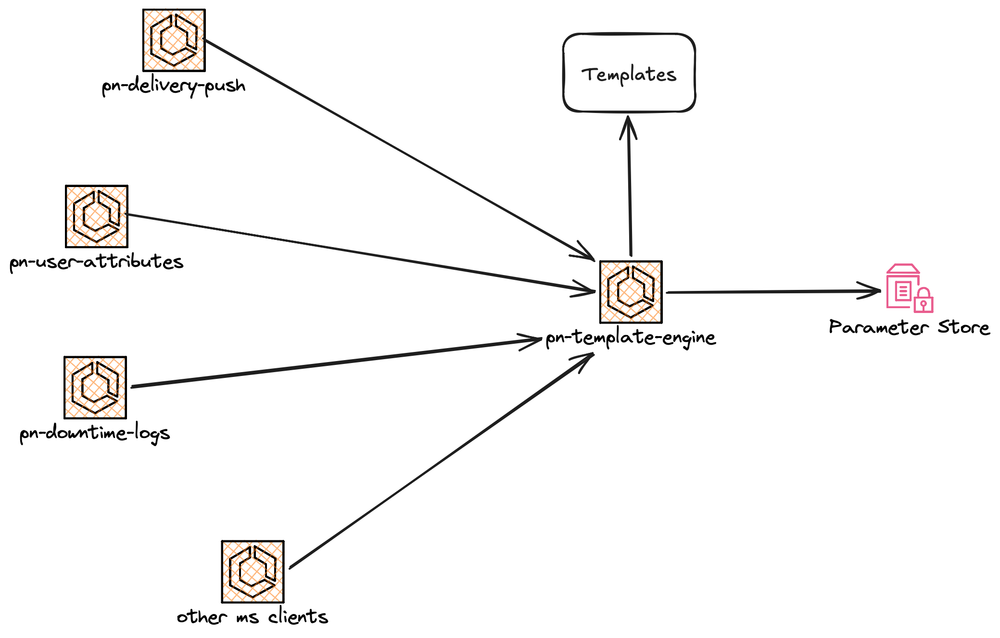

# pn-templates-engine

## Indice
- [Descrizione](#descrizione)
- [Tecnologie Utilizzate](#tecnologie-utilizzate)
- [Architettura](#architettura)
- [Interfacce del Servizio](#interfacce-del-servizio)
- [Configurazioni](#configurazioni)
- [Allarmi e Monitoraggio](#allarmi-e-monitoraggio)
- [Esecuzione](#esecuzione)

## Descrizione
`pn-templates-engine` è il microservizio SEND che genera contenuti documentali a runtime (PDF, HTML, TXT) a partire da template versionati nel repository. È usato dai servizi interni della piattaforma che richiedono la composizione del documento finale, passando payload applicativo e lingua (`x-language`).

Il servizio esiste per centralizzare la logica di rendering, mantenere uniformità multilingua e ridurre duplicazioni nei servizi chiamanti. Il dominio gestito è la composizione documentale per notifiche SEND (atti, AAR, contenuti email/PEC/SMS, OTP), con supporto opzionale alla risoluzione di risorse remote (es. logo mittente) via resolver configurabile.

## Tecnologie Utilizzate

**Linguaggi e Framework**
- Java 21 con Spring Boot WebFlux
- FreeMarker per rendering template
- OpenHTMLtoPDF + Jsoup per conversione HTML -> PDF
- ZXing per generazione QR code
- Apache Tika per MIME detection nel resolver Base64
- OpenAPI 3 con codice server generato (`openapi-generator-maven-plugin`)
- Node.js 16 per pipeline di build template (`scripts/templates-builder`)

**Infrastruttura**
- AWS ECS/Fargate (deploy del microservizio)
- Application Load Balancer con path `/templates-engine-private/*`
- AWS Systems Manager Parameter Store per whitelist resolver
- AWS CloudWatch Logs e allarmi via CloudFormation

**Storage**
- File system applicativo (`generated-templates-assets/templates`) per template compilati
- AWS Parameter Store per configurazioni whitelist URL resolver
- Nessun database relazionale/NoSQL nel codice applicativo analizzato

## Architettura

### Riferimenti architetturali

[Diagramma architetturale](docs/ms/diagrams/DiagrammaArchitetturale.excalidraw):


[Vista di insieme](docs/ms/diagrams/VistaDiInsieme.excalidraw):


Guida estesa: [Come aggiungere un template](docs/ms/AggiuntaTemplate.md)

### Descrizione architetturale
Il layer REST è implementato da `TemplateApiController`, `QrCodeApiController` e `HealthCheckApiController`, che realizzano interfacce generate dalla specifica OpenAPI (`docs/openapi/pn-internal-templates-v1.yaml`).

`TemplateService` seleziona il file template in base a template e lingua (`TemplateConfig`) con fallback su `defaultLanguage`, poi delega a `DocumentComposition` il rendering:
- PDF: FreeMarker -> HTML -> PDF
- HTML/TXT: rendering testuale o template pre-caricato come stringa (`loadAsString`)

Per i campi risolvibili (es. `senderLogoBase64`) è presente una pipeline `TemplateValueResolver -> ToBase64Resolver -> UrlResolver` con controllo whitelist opzionale (`ResolverWhitelistConfig`) alimentato da Parameter Store.

Dipendenze esterne principali: API REST in ingresso dai servizi SEND chiamanti, chiamate HTTP in uscita verso URL del payload (resolver) e lettura parametri SSM per whitelist.

### Flussi principali
1. Chiamata `PUT /templates-engine-private/v1/templates/...` con body JSON e header `x-language`.
2. Risoluzione file template da configurazione e fallback lingua.
3. Eventuale risoluzione campi dinamici (es. logo remoto in Base64).
4. Rendering template e conversione (PDF/HTML/TXT) in base all'endpoint.
5. Restituzione risposta con payload del documento generato.
6. Flusso QR separato: `GET /templates-engine-private/v1/qrcode-generator` con output JSON base64.

### Flussi secondari o di test
- Pipeline Node (`build-templates.sh` + `scripts/templates-builder`) che genera template compilati in `src/main/resources/generated-templates-assets` e li replica in `src/test/resources/generated-templates-assets`.
- Build Maven con generazione sorgenti OpenAPI in fase `generate-resources`.
- Test Java (`spring-boot-starter-test`, `reactor-test`) e test builder template (`jest`).
- Health check API su `/status`; health check infrastrutturale ALB su `/actuator/health` (CloudFormation).

## Interfacce del Servizio

Specifica OpenAPI: [pn-internal-templates-v1.yaml](docs/openapi/pn-internal-templates-v1.yaml)

| Tipo | Dir | Risorsa             | Protocollo | Metodo | Route                                           | Descrizione                                                |
|------|-----|---------------------|------------|--------|-------------------------------------------------|------------------------------------------------------------|
| API  | IN  | Template API        | REST       | PUT    | `/templates-engine-private/v1/templates/*`      | Generazione documenti PDF/HTML/TXT da template SEND        |
| API  | IN  | QR Code API         | REST       | GET    | `/templates-engine-private/v1/qrcode-generator` | Generazione QR code in Base64 da URL                       |
| API  | IN  | HealthCheck API     | REST       | GET    | `/status`                                       | Stato logico del microservizio (200/500)                   |
| API  | OUT | URL resolver remoto | REST       | GET    | URL nel payload                                 | Download risorsa remota (es. logo) da convertire in Base64 |

**Endpoint principali** (tutti con header `x-language: IT|DE|SL|FR`, tranne dove indicato)

| Metodo | Path                                                                      | Output                      | Template                        |
|--------|---------------------------------------------------------------------------|-----------------------------|---------------------------------|
| PUT    | `/templates-engine-private/v1/templates/notification-received-legal-fact` | PDF                         | `NotificationReceivedLegalFact` |
| PUT    | `/templates-engine-private/v1/templates/notification-aar`                 | PDF                         | `NotificationAAR`               |
| PUT    | `/templates-engine-private/v1/templates/notification-aar-radd-alt`        | PDF                         | `NotificationAAR_RADDalt`       |
| PUT    | `/templates-engine-private/v1/templates/notification-aar-for-email`       | HTML                        | `NotificationAARForEMAILAnalog` |
| PUT    | `/templates-engine-private/v1/templates/notification-aar-for-sms`         | TXT                         | `NotificationAARForSMSAnalog`   |
| PUT    | `/templates-engine-private/v1/templates/notification-aar-for-subject`     | TXT                         | `NotificationAARFor_Subject`    |
| PUT    | `/templates-engine-private/v1/templates/mail-verification-code-subject`   | TXT                         | `Mail_VerificationCodeSubject`  |
| GET    | `/templates-engine-private/v1/qrcode-generator?url=...`                   | JSON Base64 (`base64value`) | `-`                             |
| GET    | `/status`                                                                 | 200/500 (body vuoto)        | `-`                             |

**Esempi d'uso**

```bash
# Generazione PDF atto di ricezione notifica (lingua italiana)
curl -X PUT 'http://localhost:8099/templates-engine-private/v1/templates/notification-received-legal-fact' \
  --header 'x-language: IT' \
  --header 'Content-Type: application/json' \
  --header 'Accept: application/pdf' \
  --data '{
    "sendDate": "GG/MM/AAAA HH:MM",
    "notification": {
      "iun": "AAAA-AAAA-AAAA-000000-A-0",
      "sender": {
        "paDenomination": "Ente_Mittente",
        "paTaxId": "00000000000"
      },
      "recipients": [
        {
          "denomination": "Nome_Cognome",
          "taxId": "AAAAAA00A00A000A",
          "physicalAddressAndDenomination": "Viale_Esempio_1",
          "digitalDomicile": {
            "address": null
          }
        }
      ]
    },
    "subject": "Lorem Ipsum",
    "digests": [
      "910CD898B166E3E3E394584EB0AB1A7D445992D04BADBCA62FAEE9488B4A117A"
    ]
  }'

# Generazione QR Code
curl -X GET 'http://localhost:8099/templates-engine-private/v1/qrcode-generator?url=https://notifiche.pagopa.it/abc123'
```

## Configurazioni

| Nome                                                                       | Tipo       | Sorgente        | Valori                                | Descrizione                                                                          |
|----------------------------------------------------------------------------|------------|-----------------|---------------------------------------|--------------------------------------------------------------------------------------|
| `pn.templates-engine.parameterStoreCacheTTL`                               | duration   | ENV             | es. `10m`                             | TTL cache dei parametri whitelist letti da Parameter Store                           |
| `pn.templates-engine.urlResolverTimeout`                                   | duration   | ENV             | es. `5s`                              | Timeout delle chiamate HTTP outbound usate dal resolver URL                          |
| `templatesPath`                                                            | string     | ENV             | path relativo                         | Root path dei template compilati usati a runtime                                     |
| `defaultLanguage`                                                          | enum       | ENV             | `IT`, `DE`, `SL`, `FR`                | Lingua di fallback quando il template non è disponibile nella lingua richiesta       |
| `templates.<template>.input.<lang>`                                        | mappa      | ENV             | path file template                    | Mappa template/lingua -> file da renderizzare                                        |
| `templates.<template>.loadAsString`                                        | boolean    | ENV             | `true/false`                          | Se `true`, il contenuto è pre-caricato come stringa e restituito senza model binding |
| `templates.<template>.resolvers.senderLogoBase64.enabled`                  | boolean    | ENV             | `true/false`                          | Abilita la pipeline di risoluzione del campo `senderLogoBase64`                      |
| `templates.<template>.resolvers.senderLogoBase64.bypassAllWithNull`        | boolean    | ENV             | `true/false`                          | Forza `null` sul campo, bypassando ogni resolver                                     |
| `templates.<template>.resolvers.senderLogoBase64.returnNullOnError`        | boolean    | ENV             | `true/false`                          | In caso di errore resolver restituisce `null` invece del valore originale            |
| `templates.<template>.resolvers.senderLogoBase64.whitelistEnabled`         | boolean    | ENV             | `true/false`                          | Abilita la validazione whitelist URL prima del download remoto                       |
| `templates.<template>.resolvers.senderLogoBase64.whitelistParameterStores` | lista path | Parameter Store | es. `/pn-templates-engine/whitelist1` | Elenco parametri SSM da cui leggere gli URL consentiti                               |

## Allarmi e Monitoraggio

| Tipo      | Nome                                            | Descrizione                                                                              |
|-----------|-------------------------------------------------|------------------------------------------------------------------------------------------|
| LOG       | `${ProjectName}-templates-engine`               | Log group CloudWatch del microservizio ECS, usato per troubleshooting operativo          |
| ALARM     | `LogAlarmStrategyV1`                            | Strategia di allarme su pattern log (default `FATAL`) con notifica su `AlarmSNSTopicArn` |
| ALARM     | Health check target su `/actuator/health`       | Evidenzia indisponibilità istanza dietro ALB e impatto sulla raggiungibilità API         |

## Esecuzione

**Prerequisiti**
- Java 21
- Maven 3.8+
- Node.js 16.x

**Build**

```bash
# macOS / Linux
./build-templates.sh

# Windows
build-templates.cmd

./mvnw clean package
```

**Test**

```bash
./mvnw test

cd scripts/templates-builder
npm ci
npm test
```

**Avvio locale**

```bash
./mvnw spring-boot:run

# alternativa: esecuzione JAR
./mvnw clean package
java -jar target/pn-templates-engine-*.jar
```
