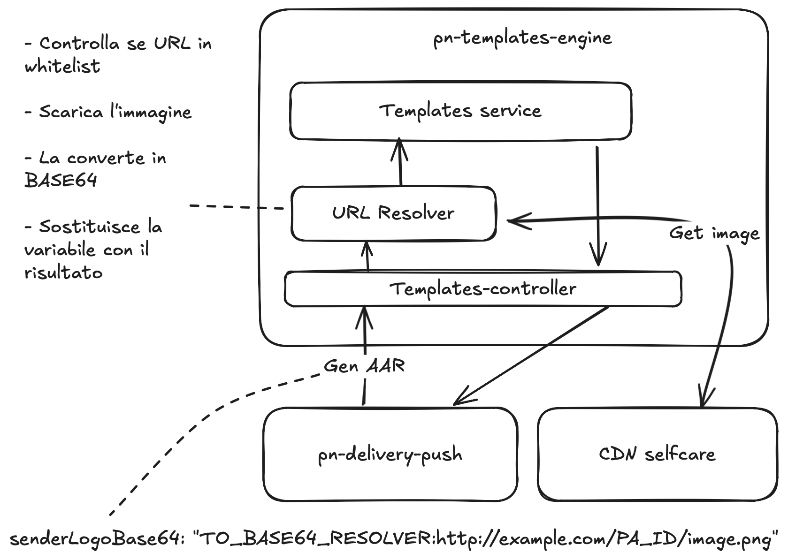
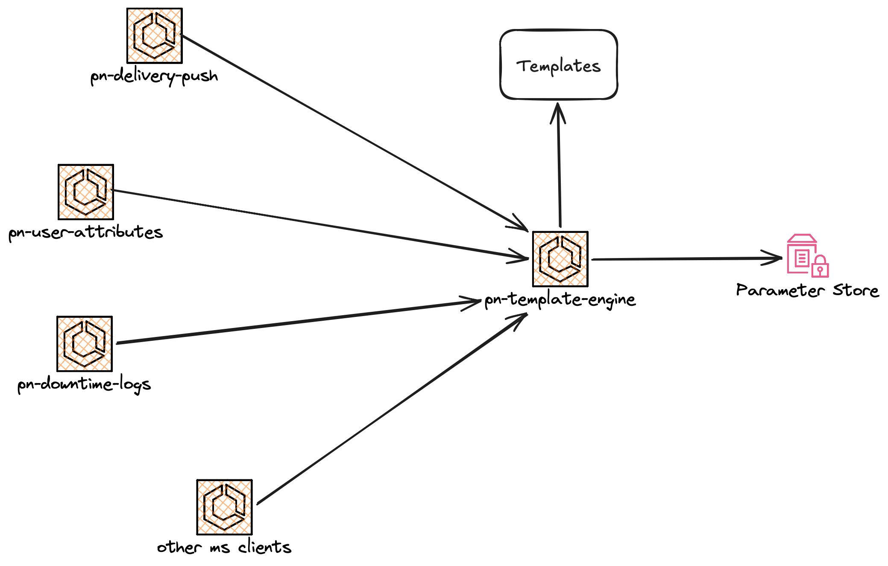

# pn-templates-engine

## Indice
- [Descrizione](#descrizione)
- [How to: aggiungere un template](#how-to-aggiungere-un-template)
- [Tecnologie Utilizzate](#tecnologie-utilizzate)
- [Architettura](#architettura)
- [Interfacce del Servizio](#interfacce-del-servizio)
- [Configurazioni](#configurazioni)
- [Allarmi e Monitoraggio](#allarmi-e-monitoraggio)
- [Esecuzione](#esecuzione)
- [Design of dima Postel](#design-of-dima-postel)

## Descrizione
`pn-templates-engine` è il microservizio SEND che genera contenuti documentali a runtime (PDF, HTML, TXT) a partire da template versionati nel repository. È usato dai servizi interni della piattaforma che richiedono la composizione del documento finale, passando payload applicativo e lingua (`x-language`).

Il servizio esiste per centralizzare la logica di rendering, mantenere uniformità multilingua e ridurre duplicazioni nei servizi chiamanti. Il dominio gestito è la composizione documentale per notifiche SEND (atti, AAR, contenuti email/PEC/SMS, OTP), con supporto opzionale alla risoluzione di risorse remote (es. logo mittente) via resolver configurabile.

## How to: aggiungere un template
Guida estesa: [Come aggiungere un template](docs/ms/aggiunta_template.md)

## Tecnologie Utilizzate

### Stack Tecnologico
- Java 21
- Spring Boot WebFlux
- FreeMarker
- OpenHTMLtoPDF
- Jsoup
- ZXing
- Apache Tika
- OpenAPI 3 con generazione delle interfacce server tramite `openapi-generator-maven-plugin`
- Node.js 16 per la pipeline di build dei template in `scripts/templates-builder`

### Infrastruttura
- AWS ECS Fargate
- AWS Systems Manager Parameter Store
- AWS CloudFormation
- AWS CloudWatch Logs

## Architettura



> [Sorgente Diagramma](docs/ms/diagrams/DiagrammaArchitetturale.excalidraw)

Il flusso principale parte dalle API REST implementate da `TemplateApiController`, `QrCodeApiController` e `HealthCheckApiController`, che realizzano le interfacce generate dalla specifica OpenAPI in `docs/openapi/pn-internal-templates-v1.yaml`. Le richieste di generazione vengono instradate verso `TemplateService`, che seleziona il file corretto in base al template e alla lingua, applica il fallback su `defaultLanguage` quando la traduzione richiesta non è disponibile e delega a `DocumentCompositionImpl` il rendering con FreeMarker; per i documenti PDF il contenuto HTML risultante viene poi convertito tramite OpenHTMLtoPDF e Jsoup.

Per i template che configurano campi risolvibili, come `senderLogoBase64`, il flusso passa da `TemplateValueResolver`, che applica le regole del resolver, verifica opzionalmente la whitelist caricata da `ResolverWhitelistConfig` tramite Parameter Store e usa `ToBase64Resolver` e `UrlResolver` per scaricare la risorsa remota e trasformarla in Data URL Base64. La pipeline di build dei template parte dagli asset in `templates-assets/templates`, genera gli artefatti in `src/main/resources/generated-templates-assets` tramite gli script Node del builder e replica gli stessi asset in `src/test/resources/generated-templates-assets` durante la build dei template.


> [Vista di insieme](docs/ms/diagrams/VistaDiInsieme.excalidraw)


[**Architettura interna**](docs/ms/architettura_interna.md)

## Interfacce del Servizio

Specifica OpenAPI: [pn-internal-templates-v1.yaml](docs/openapi/pn-internal-templates-v1.yaml)

Il servizio non consuma né produce eventi.

| Tipo | Dir | Risorsa                       | Protocollo | Metodo | Route                                                                                                                                                                                                                                                                                                                                                                                                                                                                                                                                                                                                                                                                                                                                                                                    | Descrizione                                                                              |
|------|-----|-------------------------------|------------|--------|------------------------------------------------------------------------------------------------------------------------------------------------------------------------------------------------------------------------------------------------------------------------------------------------------------------------------------------------------------------------------------------------------------------------------------------------------------------------------------------------------------------------------------------------------------------------------------------------------------------------------------------------------------------------------------------------------------------------------------------------------------------------------------------|------------------------------------------------------------------------------------------|
| API  | IN  | Health check                  | REST       | GET    | `/status`                                                                                                                                                                                                                                                                                                                                                                                                                                                                                                                                                                                                                                                                                                                                                                                | Restituisce lo stato logico del microservizio con esito `200` o `500`.                   |
| API  | IN  | Generazione PDF               | REST       | PUT    | `/templates-engine-private/v1/templates/notification-received-legal-fact`<br>`/templates-engine-private/v1/templates/pec-delivery-workflow-legal-fact`<br>`/templates-engine-private/v1/templates/notification-viewed-legal-fact`<br>`/templates-engine-private/v1/templates/malfunction-legal-fact`<br>`/templates-engine-private/v1/templates/notification-cancelled-legal-fact`<br>`/templates-engine-private/v1/templates/analog-delivery-workflow-failure-legal-fact`<br>`/templates-engine-private/v1/templates/analog-delivery-workflow-timeout-legal-fact`<br>`/templates-engine-private/v1/templates/notification-aar-radd-alt`<br>`/templates-engine-private/v1/templates/notification-aar`<br>`/templates-engine-private/v1/templates/analog-feedback-availability-statement` | Genera documenti PDF a partire da payload JSON e lingua richiesta.                       |
| API  | IN  | Generazione HTML              | REST       | PUT    | `/templates-engine-private/v1/templates/notification-aar-for-email`<br>`/templates-engine-private/v1/templates/notification-aar-for-email-digital`<br>`/templates-engine-private/v1/templates/notification-aar-for-pec`<br>`/templates-engine-private/v1/templates/mail-verification-code-body`<br>`/templates-engine-private/v1/templates/pec-verification-code-body`<br>`/templates-engine-private/v1/templates/pec-validation-contacts-success-body`<br>`/templates-engine-private/v1/templates/pec-validation-contacts-reject-body`<br>`/templates-engine-private/v1/templates/notification-cce-for-email`                                                                                                                                                                           | Genera contenuti HTML destinati ai canali email e PEC.                                   |
| API  | IN  | Generazione TXT con payload   | REST       | PUT    | `/templates-engine-private/v1/templates/notification-aar-for-sms`<br>`/templates-engine-private/v1/templates/notification-aar-for-sms-digital`<br>`/templates-engine-private/v1/templates/notification-aar-for-subject`                                                                                                                                                                                                                                                                                                                                                                                                                                                                                                                                                                  | Genera contenuti testuali a partire da un payload JSON.                                  |
| API  | IN  | Generazione TXT senza payload | REST       | PUT    | `/templates-engine-private/v1/templates/sms-verification-code-body`<br>`/templates-engine-private/v1/templates/mail-verification-code-subject`<br>`/templates-engine-private/v1/templates/pec-verification-code-subject`<br>`/templates-engine-private/v1/templates/pec-validation-contacts-success-subject`<br>`/templates-engine-private/v1/templates/pec-validation-contacts-reject-subject`                                                                                                                                                                                                                                                                                                                                                                                          | Restituisce contenuti testuali precaricati o generati senza request body applicativo.    |
| API  | IN  | Generazione QR code           | REST       | GET    | `/templates-engine-private/v1/qrcode-generator`                                                                                                                                                                                                                                                                                                                                                                                                                                                                                                                                                                                                                                                                                                                                          | Restituisce un QR code in Base64 per l'URL passato come query parameter.                 |
| API  | OUT | Download risorse remote       | REST       | GET    | URL presenti nei campi del payload gestiti dai resolver, ad esempio `senderLogoBase64`                                                                                                                                                                                                                                                                                                                                                                                                                                                                                                                                                                                                                                                                                                   | Recupera risorse remote da convertire in Base64 per i template che attivano il resolver. |

## Configurazioni

| Nome                                                                                   | Sorgente        | Valori                                 | Descrizione                                                                                                          |
|----------------------------------------------------------------------------------------|-----------------|----------------------------------------|----------------------------------------------------------------------------------------------------------------------|
| `PN_TEMPLATESENGINE_PARAMETERSTORECACHETTL`                                            | ENV             | `10m`                                  | Definisce il tempo di cache con cui vengono riletti i parametri di whitelist dal Parameter Store.                    |
| `PN_TEMPLATESENGINE_URLRESOLVERTIMEOUT`                                                | ENV             | `5s`                                   | Imposta il timeout delle chiamate HTTP eseguite dal resolver verso URL esterni.                                      |
| `DEFAULTLANGUAGE`                                                                      | ENV             | `IT`, `DE`, `SL`, `FR`                 | Definisce la lingua di fallback usata quando il template richiesto non è disponibile nella lingua ricevuta.          |
| `TEMPLATESPATH`                                                                        | ENV             | `generated-templates-assets/templates` | Indica il percorso radice dei template compilati usati a runtime dal microservizio.                                  |
| `TEMPLATES_NOTIFICATIONAAR_RESOLVERS_SENDERLOGOBASE64_BYPASSALLWITHNULL`               | ENV             | `true`, `false`                        | Per `NotificationAar` consente di annullare il campo `senderLogoBase64` senza eseguire la risoluzione remota.        |
| `TEMPLATES_NOTIFICATIONAAR_RESOLVERS_SENDERLOGOBASE64_WHITELISTENABLED`                | ENV             | `true`, `false`                        | Per `NotificationAar` abilita il controllo della whitelist prima del download della risorsa remota.                  |
| `TEMPLATES_NOTIFICATIONAAR_RESOLVERS_SENDERLOGOBASE64_WHITELISTPARAMETERSTORES`        | ENV             | `/pn-templates-engine/whitelist1`      | Per `NotificationAar` indica il parametro da cui leggere gli URL consentiti al resolver.                             |
| `TEMPLATES_NOTIFICATIONAARRADDALT_RESOLVERS_SENDERLOGOBASE64_BYPASSALLWITHNULL`        | ENV             | `true`, `false`                        | Per `NotificationAarRaddAlt` consente di annullare il campo `senderLogoBase64` senza eseguire la risoluzione remota. |
| `TEMPLATES_NOTIFICATIONAARRADDALT_RESOLVERS_SENDERLOGOBASE64_WHITELISTENABLED`         | ENV             | `true`, `false`                        | Per `NotificationAarRaddAlt` abilita il controllo della whitelist prima del download della risorsa remota.           |
| `TEMPLATES_NOTIFICATIONAARRADDALT_RESOLVERS_SENDERLOGOBASE64_WHITELISTPARAMETERSTORES` | ENV             | `/pn-templates-engine/whitelist1`      | Per `NotificationAarRaddAlt` indica il parametro da cui leggere gli URL consentiti al resolver.                      |

## Allarmi e Monitoraggio

| Tipo  | Nome                 | Descrizione                                                                                                                             |
|-------|----------------------|-----------------------------------------------------------------------------------------------------------------------------------------|
| LOG   | `EcsLogGroup`        | Identifica il gruppo CloudWatch Logs associato alle task del microservizio e usato per il troubleshooting operativo.                    |
| ALARM | `LogAlarmStrategyV1` | Applica una strategia di allarme basata sui log, con valore di default `FATAL`, per segnalare errori applicativi con impatto operativo. |
| ALARM | `HealthCheckPath`    | Monitora il path `/actuator/health` per rilevare istanze non raggiungibili o non sane dietro il load balancer.                          |

## Esecuzione

**Prerequisiti**
- Java 21
- Maven 3.8+
- Node.js 16.x

**Build**

```bash
# build solo templates macOS / Linux
./build-templates.sh

# build solo templates Windows
build-templates.cmd

# build microservice completo
./mvnw clean package
```

**Test**

```bash
./mvnw test

cd scripts/templates-builder
npm ci
npm test
```

**Avvio locale**

```bash
./mvnw spring-boot:run
```

## Helpers
Put this html in <main> to show lines and dima
[Design of dima Postel](docs/ms/dima_postel.md)

Put this html replacing <main> opening tag in AAR and AAR RADD alt
[Design of FACSIMILE in AAR](docs/ms/facsimile-aar.md) 

Put this html in <main> tag of AO3
[Design of FACSIMILE in AO3](docs/ms/facsimile-ao3.md)

